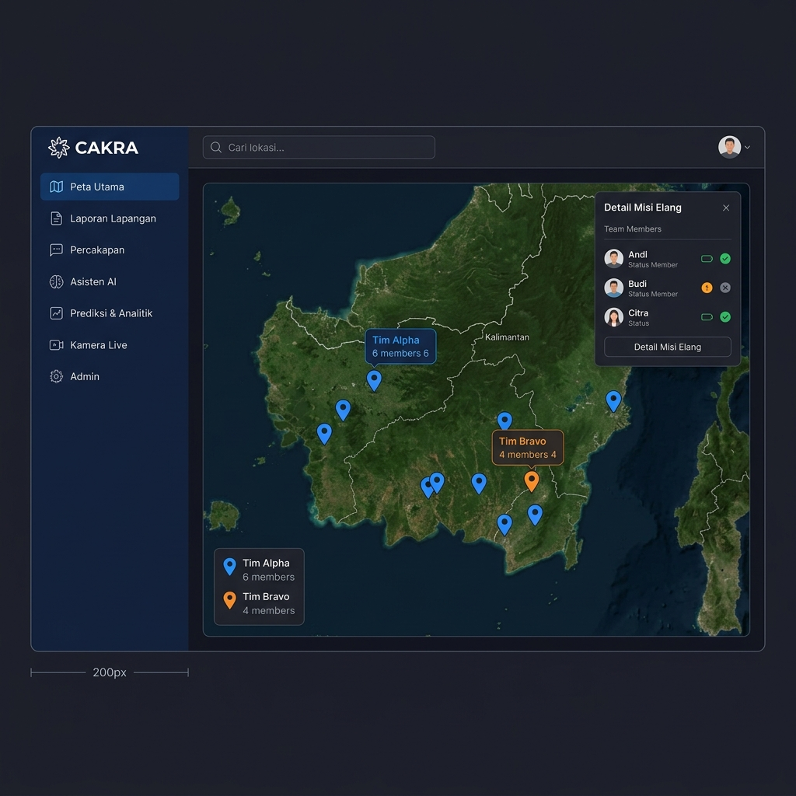
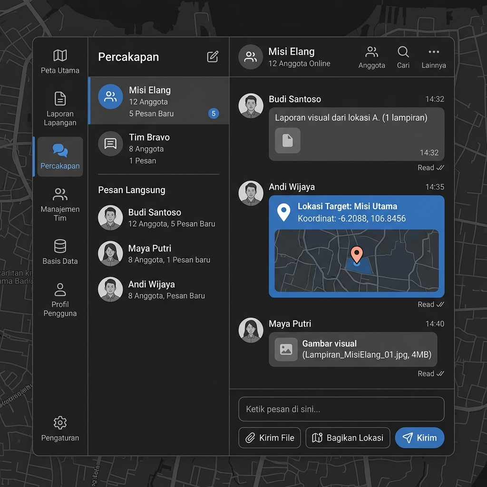
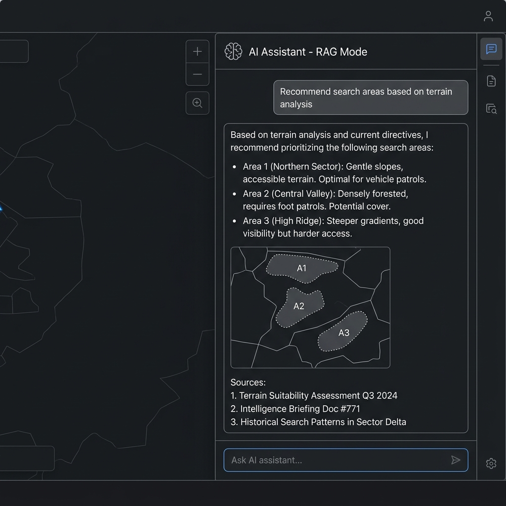
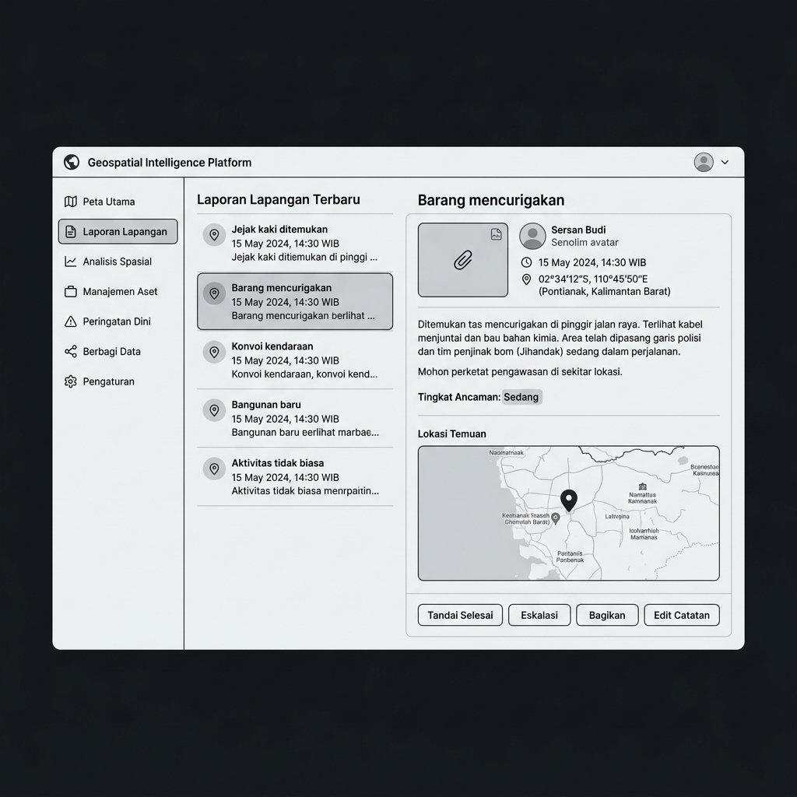
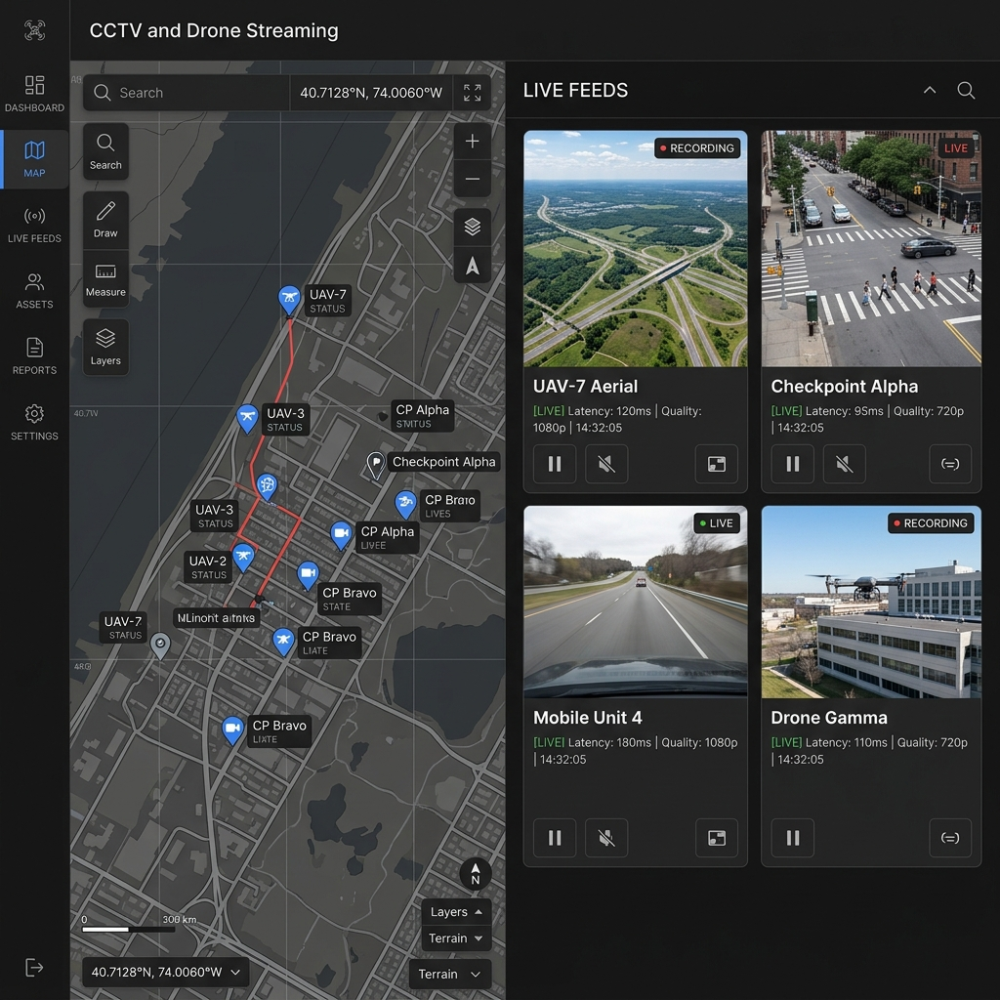
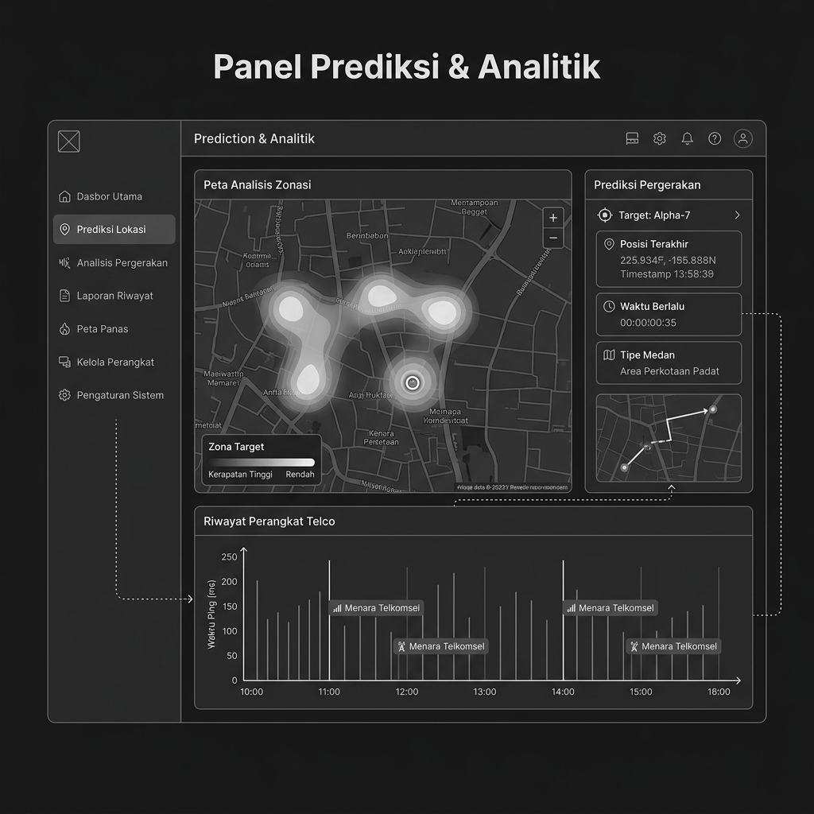
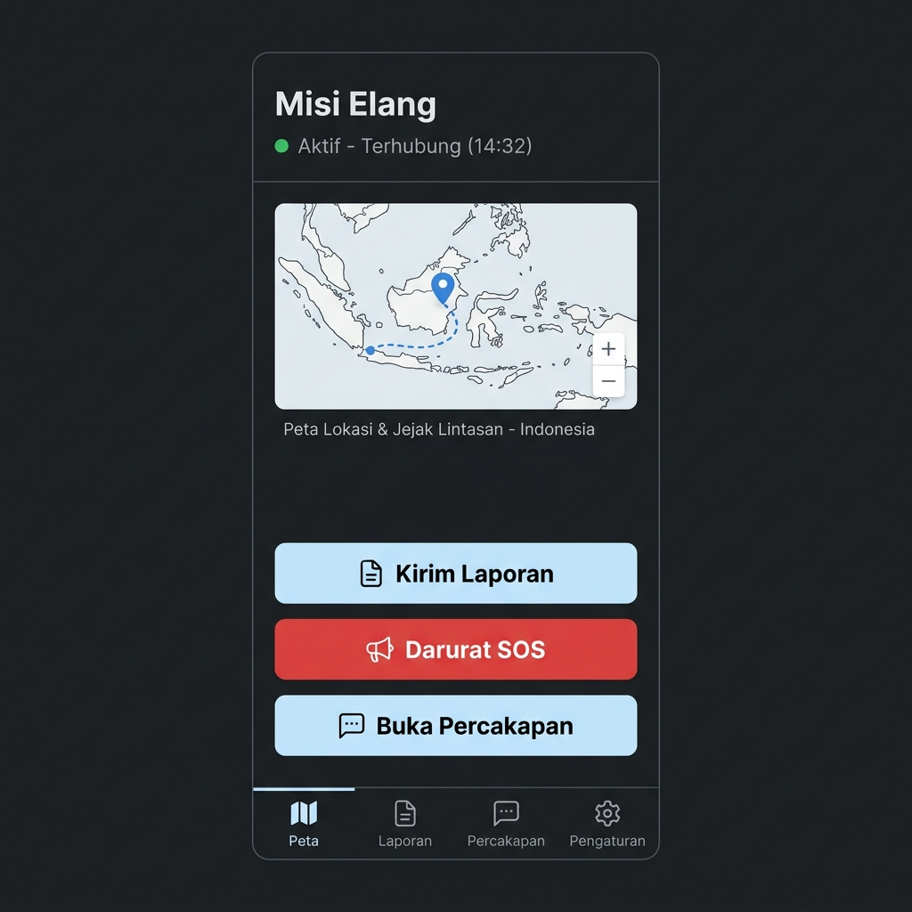
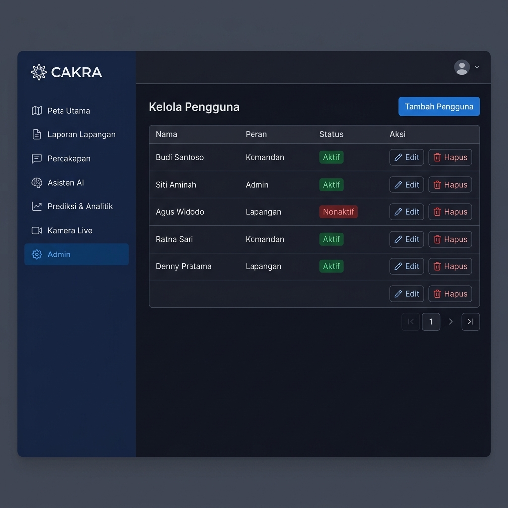
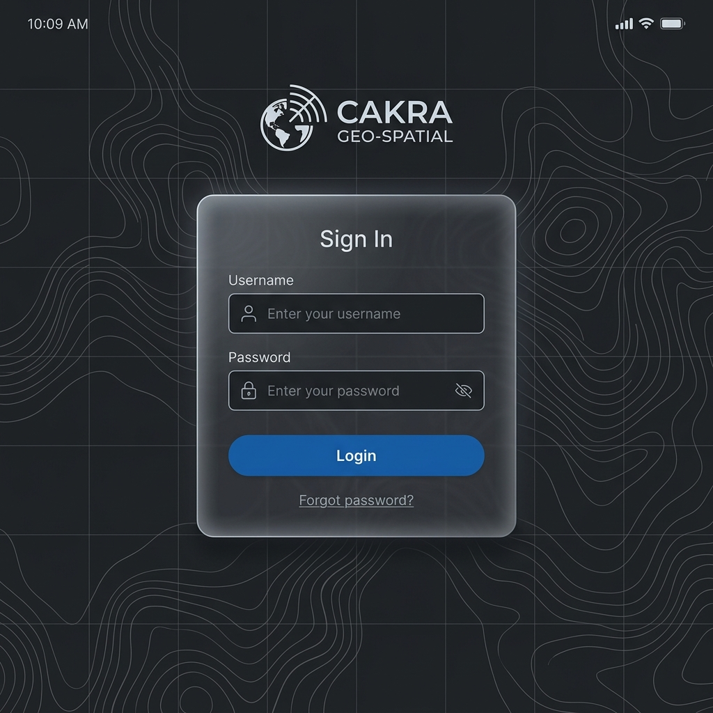

# CAKRA Intelligence Platform

> **Internal Document — Openscopelabs**
> Platform intelijen geospasial untuk operasi pelacakan, pencarian, dan monitoring.

---

## 📋 Project Overview

| Aspek                   | Detail                                  |
| ----------------------- | --------------------------------------- |
| **Client**        | Cakra Inteligence                       |
| **Developer**     | Openscopelabs (3 orang)                 |
| **Nilai Kontrak** | Rp 100.000.000                          |
| **Durasi**        | 4 bulan (Mei – Agustus 2026)           |
| **Metode**        | Agile Scrum (2 minggu/sprint, 8 sprint) |
| **Referensi App** | [Palantir](https://www.palantir.com/)      |

---

## 👥 Tim Developer

| Nama             | Focus            | Area                                      |
| ---------------- | ---------------- | ----------------------------------------- |
| **Robby**  | Frontend         | UI/UX, MapLibre GL, Dashboard, Responsive |
| **Hackim** | Backend          | NestJS API, Database, Auth, AI/RAG        |
| **Firly**  | Backend & DevOps | Docker/K8s, CI/CD, Streaming, Monitoring  |

---

## 🛠 Tech Stack

| Layer        | Teknologi                           | Lisensi       |
| ------------ | ----------------------------------- | ------------- |
| Frontend     | React 19 + Vite 6 + TypeScript      | MIT           |
| Map Engine   | MapLibre GL JS                      | BSD-3         |
| Backend      | NestJS + TypeScript                 | MIT           |
| ORM          | Prisma + PostGIS extension          | Apache 2.0    |
| Real-time    | Socket.IO                           | MIT           |
| Database     | PostgreSQL 16 + PostGIS (port 5433) | PostgreSQL    |
| Cache        | Redis 7                             | BSD-3         |
| LLM (prod)   | OpenAI GPT-4o-mini ★               | Paid (client) |
| LLM (dev)    | Ollama + Llama 3.1                  | MIT/Meta      |
| Embedding    | OpenAI text-embedding-3-small ★    | Paid (client) |
| Vector DB    | Qdrant (self-hosted, port 6334)     | Apache 2.0    |
| Media Server | Node-Media-Server                   | MIT           |
| Container    | Docker + Kubernetes                 | Apache 2.0    |
| CI/CD        | GitHub Actions                      | Free tier     |
| Monitoring   | Grafana + Prometheus                | AGPL/Apache   |
| Password     | Argon2                              | CC0           |
| SSL          | Let's Encrypt + Certbot             | Free          |
| API Docs     | Swagger / OpenAPI V3                | Apache 2.0    |

**★** = Berbayar, disediakan oleh client (kita terima API key saja)

---

## 💰 Pembayaran

| Termin   | Waktu               | %   | Nominal       |
| -------- | ------------------- | --- | ------------- |
| Termin 1 | Penandatanganan MOU | 25% | Rp 25.000.000 |
| Termin 2 | Penyelesaian Fase 1 | 25% | Rp 25.000.000 |
| Termin 3 | Penyelesaian Fase 2 | 25% | Rp 25.000.000 |
| Termin 4 | Serah terima akhir  | 25% | Rp 25.000.000 |

**Rate scope change**: Rp 500.000/orang/hari

---

## 📅 Timeline (8 Sprint)

| Fase             | Sprint | Bulan | Focus                                     | Milestone            |
| ---------------- | ------ | ----- | ----------------------------------------- | -------------------- |
| **Fase 1** | 1-2    | 1     | Foundation, Auth, Map, GPS, Field Reports | Demo peta + tracking |
| **Fase 2** | 3-4    | 2     | Chat, Weather, Drawing, 3D, Heat Map      | Demo chat + layers   |
| **Fase 3** | 5-6    | 3     | AI/RAG, Prediction, Telco, Auto Alert     | Demo AI + prediction |
| **Fase 4** | 7-8    | 4     | CCTV, Drone, CV, Deploy, Testing          | Serah terima         |

Detail per sprint → lihat `docs/sprint-plan.html`

---

## 🗂 Struktur Dokumen

### Untuk Client (dikirim)

| File              | Deskripsi                                               |
| ----------------- | ------------------------------------------------------- |
| `docs/MOU.html` | Memorandum of Understanding (kontrak legal)             |
| `docs/SOW.html` | Statement of Work (scope, timeline, pembayaran)         |
| `docs/SDD.html` | Solutions Design Document (arsitektur, tech stack)      |
| `docs/PRD.html` | Product Requirements Document (kebutuhan produk)       |

### Internal (tidak dikirim)

| File                              | Deskripsi                                      |
| --------------------------------- | ---------------------------------------------- |
| `docs/SPRINT-PLAN.html`         | Detail sprint 1-8, task per developer          |
| `docs/ERD.html`                 | Mermaid ERD diagram (16 entitas)               |
| `docs/INTERNAL-PRICING.html`    | ⚠ Breakdown harga per modul (CONFIDENTIAL)     |
| `README.md`                     | Project overview (file ini)                    |

### Referensi

| File                   | Deskripsi                          |
| ---------------------- | ---------------------------------- |
| `docs/referensi.txt` | Link referensi & sample data telco |

---

## 🖼 UI Mockups / Wireframes

Berikut adalah rancangan antarmuka (wireframes) untuk platform yang akan dibangun, mencakup seluruh alur kerja utama:

1. **Dashboard Utama (Peta & Tracking)**


2. **Panel Komunikasi (Chat)**


3. **Asisten AI (RAG Mode)**


4. **Laporan Lapangan (Field Reports)**


5. **Streaming Video (CCTV & Drone)**


6. **Prediksi & Analitik (Heat Map & Telco)**


7. **Tampilan Mobile (Field Operator)**


8. **Manajemen Pengguna (Admin)**


9. **Halaman Login**


---

## 🏗 Arsitektur

```
┌─────────────────────────────────────────────────────┐
│              NGINX (Reverse Proxy + SSL)             │
│              Let's Encrypt (port 80, 443)            │
└──────────┬─────────────────────────┬────────────────┘
           │                         │
┌──────────▼──────────┐  ┌───────────▼──────────────┐
│   FRONTEND          │  │   BACKEND                 │
│   React + Vite      │  │   NestJS (TypeScript)     │
│   MapLibre GL JS    │  │   ├── Auth (Argon2/JWT)   │
│   Socket.IO Client  │  │   ├── Map Module          │
│   port 3100         │  │   ├── Tracking Module     │
│                     │  │   ├── Chat (Socket.IO)    │
│                     │  │   ├── AI/RAG Module       │
│                     │  │   ├── Streaming Module    │
│                     │  │   ├── Alert Module        │
│                     │  │   └── Telco Module        │
│                     │  │   port 4100               │
└─────────────────────┘  └───┬──────────┬────────────┘
                             │          │
     ┌───────────────────────┘          └─────────┐
     │                                             │
┌────▼───────────┐ ┌────────┐ ┌───────────────────▼┐
│ PostgreSQL 16  │ │ Redis 7│ │ Qdrant             │
│ + PostGIS      │ │ Cache  │ │ Vector embeddings  │
│ port 5433      │ │ 6380   │ │ port 6334          │
└────────────────┘ └────────┘ └────────────────────┘
         │
┌────────▼──────────┐  ┌──────────────────────┐
│ Node-Media-Server │  │ Grafana + Prometheus │
│ RTSP/RTMP relay   │  │ Monitoring           │
│ port 1936, 8100   │  │ port 3200, 9091      │
└───────────────────┘  └──────────────────────┘
```

---

## 📊 Database (16 Entitas)

Detail ERD → lihat `docs/erd.html`

| Entitas                      | Fase | Geospasial |
| ---------------------------- | ---- | :--------: |
| Users, Sessions              | 1    |     —     |
| Missions, Targets            | 1    |     ✅     |
| TrackingData                 | 1    |     ✅     |
| FieldReports                 | 1    |     ✅     |
| MapDrawings                  | 2    |     ✅     |
| ChatRooms, ChatMessages      | 2    |     ✅     |
| AlertRules, AlertLogs        | 3    |     —     |
| TelcoDevices, TelcoPositions | 3    |     ✅     |
| Documents, DocumentChunks    | 3    |     —     |
| StreamSources                | 4    |     ✅     |

---

## ⚠️ Fitur yang Butuh Konfirmasi Client

| Fitur                  | Status                 | Yang Dibutuhkan                |
| ---------------------- | ---------------------- | ------------------------------ |
| 🟡 Peta 3D             | Perlu klarifikasi      | Full terrain atau tilted view? |
| 🟡 CCTV                | Butuh hardware         | RTSP/HLS URL dari client       |
| 🟡 Drone streaming     | Butuh hardware         | Drone + RTMP output            |
| 🟡 CV Model            | Depends Tim Data Cakra | REST API endpoint              |
| 🟡 Telco geospatial    | Butuh data             | CID lookup JSON dari client    |
| 🟡 Google Maps traffic | Butuh API key          | Client buat akun Google Cloud  |
| 🔴 Drone control       | Experimental           | Raspberry Pi + protocol R&D    |
| 🔴 Radio HT            | Experimental           | Hardware HT + protocol R&D     |

---

## 🔑 Resource dari Client (Checklist)

### Sebelum Sprint 1

- [ ] MOU + SOW + SDD ditandatangani
- [ ] Termin 1 dibayar (Rp 25.000.000)
- [ ] 3 Server ready → IP + SSH credentials
- [ ] Domain dibeli → DNS access
- [ ] MapTiler API key (free tier)
- [ ] PIC ditunjuk → nama + WA
- [ ] CID lookup JSON (telco)

### Sebelum Fase 3

- [ ] OpenAI API key (billing active)
- [ ] Google Maps API key (billing active)
- [ ] Dokumen knowledge base (PDF/Word)

### Sebelum Fase 4

- [ ] CCTV terkoneksi → RTSP URL
- [ ] Drone + streaming → RTMP URL
- [ ] CV model dari Tim Data → API endpoint
- [ ] Server production (jika beda dari dev)

---

## 📄 Dokumen Online

- MOU: https://openscope-labs.github.io/open-intelligence-platform/MOU.html
- SDD: https://openscope-labs.github.io/open-intelligence-platform/SDD.html
- SOW: https://openscope-labs.github.io/open-intelligence-platform/SOW.html
- PRD: https://openscope-labs.github.io/open-intelligence-platform/PRD.html
- ERD: https://openscope-labs.github.io/open-intelligence-platform/ERD.html
- SPRINT-PLAN: https://openscope-labs.github.io/open-intelligence-platform/SPRINT-PLAN.html

---

*Last updated: 15 Mei 2026 — Openscopelabs*
